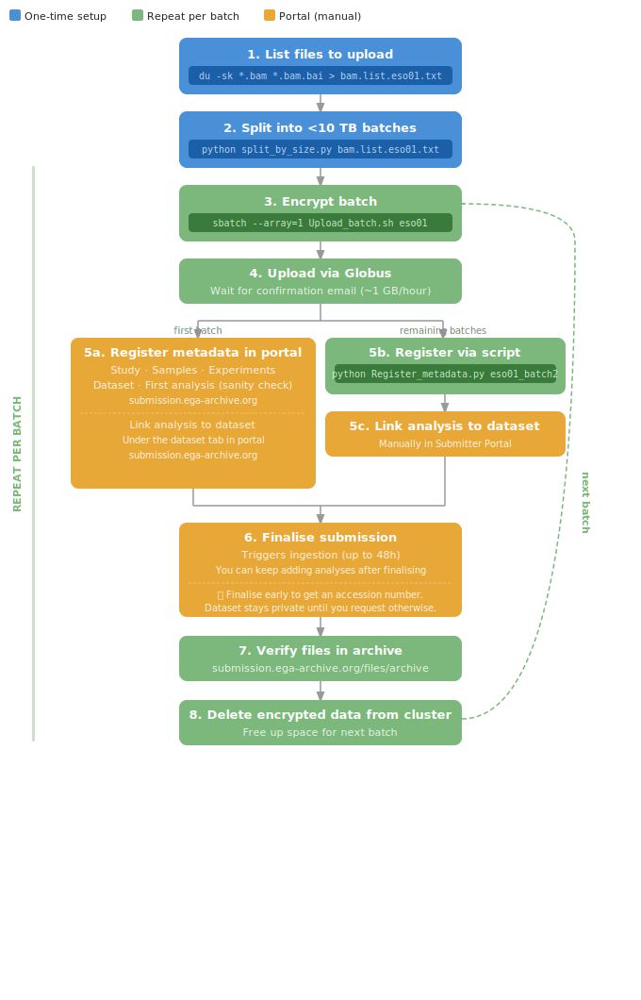

# EGA Submission Guide — Landau Lab

This guide documents the full process for submitting genomic data to the [European Genome-phenome Archive (EGA)](https://ega-archive.org/).

It is specifically aimed at **SMART-PTA or single-cell whole-genome sequencing datasets** where each sample generates hundreds to thousands of high-depth BAM files. Manually loading files one by one through the EGA web portal is not feasible at this scale, so this guide covers both the portal workflow (for study and sample registration) and a programmatic approach using the EGA Submitter Portal API (for batch analysis registration). Ultima Genomic delivers mapped alignments (BAM files) rather than raw reads. For that reason, the raw data will be deposited as ANALYSIS (Reference Alignment type) rather than RUNS.

---

## 1. Account Setup

### 1.1 Create a Personal EGA Account
[Register here](https://ega-archive.org/register/) and wait for account verification.

### 1.2 Obtain a Data Processing Agreement (DPA)
The DPA requires a signature from a legal representative at Cornell. You will need to provide:
- A title for the dataset
- Data elements description
- Number of subjects
- An IRB number

### 1.3 Set Up a DAC (Data Access Committee)


>Ask **Jane and Catherine** if you need help with DPA or DAC.

### 1.4 Request a Submitter Role
Once your account is validated, [request a submitter role](https://profile.ega-archive.org/submitter-request).

> **Note:** This step may not be required if you are granted access to the lab shared box instead (see below).

### 1.5 Request Access to the Lab Shared Box
Open a [Helpdesk ticket](https://ega-archive.org/need-help/) to request access to the lab common box: ega-box-2193. The EGA inbox has a default quota of 10 TB, so large submissions must be uploaded in batches. In practice there may be no hard limit, but if you anticipate exceeding 10 TB it is safer to contact the EGA helpdesk (once the access to be box is granted) to avoid being blocked.

EGA will send a PDF by email requesting:
- Authorization from **Dan**
- A list of all current users to be added

---

## 2. Lab EGA Box Credentials

Credentials can be stored on the cluster at:

```bash
cat ~/.ega_credentials
```

The file contains:
```bash
export EGA_BOX=ega-box-2193
export ASPERA_SCP_PASS=<password>
```

---


## 3. Workflow, Directory Structure and Scripts



Previous EGA upload work lives at:

```
/gpfs/commons/groups/landau_lab/ResolveOME/EGA_upload/
```

Key files and folders:

```
EGA_upload/
├── data_paths/                               # Per-donor file lists (input to encryption)
│   └── <donor>_batches/
│       └── bam.list.<donor>.batch<N>.txt     # du-format: <size_kb>  <file_path>
├── EGA-Cryptor-2.0.0/                        # EGA encryption tool (Java)
├── <donor>_batch<N>/                         # Encrypted output folders (one per batch)
│   ├── *.bam.gpg                             # Encrypted BAM files
│   ├── *.bam.bai.gpg                         # Encrypted BAM index files
│   ├── *.md5                                 # Checksums (not submitted to EGA)
│   └── ListFiles.txt                         # List of files in this batch
├── split_by_size.py                          # Split file lists into ≤N TB batches
├── Upload_batch.sh                           # SLURM job: encrypt one batch
├── Upload_batch_missing.sh                   # SLURM job: re-encrypt failed files
├── Register_metadata.py                      # API script: create analysis for a batch
└── Register_metadata_manual.py              # API script: add files to existing analysis
```

**`split_by_size.py`** splits a full `du`-format BAM list into batches of up to 10 TB each, keeping each `.bam` and `.bam.bai` pair together. Run this first if your donor has more data than fits in a single transfer.

```bash
python3 split_by_size.py data_paths/bam.list.eso01.txt --max-tb 10
# Outputs: bam.list.eso01.batch1.txt, bam.list.eso01.batch2.txt, ...
```

**`Upload_batch.sh`** is a SLURM job that encrypts all BAM files for a given donor and batch using EGA-Cryptor. Submit with `--array` to specify the batch number:

```bash
sbatch --array=1 Upload_batch.sh eso01     # encrypts batch 1 for eso01
sbatch --array=1-5 Upload_batch.sh eso01   # encrypts batches 1 through 5
```

**`Upload_batch_missing.sh`** does the same but only re-encrypts files that failed or are missing from a previous run.

---

## 4. Encrypt the Data (~12 hours for 10TB)

Navigate to the upload directory and submit the encryption job:

```bash
cd /gpfs/commons/groups/landau_lab/ResolveOME/EGA_upload
sbatch --array=1 Upload_batch.sh eso01
```

Files should be encrypted with [Crypt4GH](https://ega-archive.org/submission/data/file-preparation/crypt4gh/) before upload. Encrypted files will have a `.gpg` extension.

---

## 4. Upload the Data

### Option A: Globus (recommended for large datasets)

Aspera was confirmed not working by the EGA team at the time of writing. Use Globus instead (see RESCOMP ticket [RESCOMP-20030](https://jira.nygenome.org/browse/RESCOMP-20030)).

**Setup:**
1. Log in to Globus using the Google Authenticator app
2. Set up the endpoint using the PDT: [NYGC Globus login instructions](https://wiki.nygenome.org/spaces/rescomp/pages/165609778/How+to+login+to+Globus+with+SSO)
3. Go to [Globus File Manager](https://app.globus.org/file-manager/gcp) and click **FILE MANAGER**

**Left panel (source — NYGC):**

- Data under `gpfs/commons/groups`: use the [groups endpoint](https://app.globus.org/file-manager/collections/529df0b0-5a48-4266-ac76-9feba72449a6/overview). Remove everything before `landau_lab` to navigate to your folder.
- Data under your home directory: use the [home endpoint](https://app.globus.org/file-manager/collections/c50f3e55-0997-4c13-92a4-ba7a4b8d74ad)

**Right panel (destination):** EMBL-EBI Private Collection

You will receive an email once the Globus transfer completes. Transfer speed is approximately 1 GB/hour, so plan accordingly for large datasets.

### Option B: FTP (small datasets only)

```bash
ftp ftp.ega.ebi.ac.uk
```

See [EGA FTP instructions](https://ega-archive.org/submission/data/uploading-files/ftp/).

---

## 5. Register Metadata in the Submitter Portal

Before registering analyses programmatically, the study, samples, experiments, dataset, and first analysis must be created manually through the portal. Go to [https://submission.ega-archive.org/submissions](https://submission.ega-archive.org/submissions).

Click the **"Create a submission"** green button at the top right. Follow the instructions to complete the **info**, **study**, **samples**, **experiments**, first **analysis** (covering your first batch, up to 10TB) and the **dataset**. Don't forget linking the analysis to the study under the study tab. You will not need to fill in **runs** if your data are mapped BAMs.


> **Tip:** Finalise the submission early to obtain an accession number, which may be needed for a manuscript. You can continue adding analyses after finalisation. The dataset will remain private until the EGA team contacts you to confirm you are ready to make it public. You can continue adding datasets after the submission has been made public. 
 

---

## 6. Register Metadata Programmatically

Once the new batch is uploaded using globus, register metadata using the EGA Submitter Portal API. The scripts below (Register_metadata.py and Register_metadata_manual.py) automate analysis creation for the esophagus study. Replace with your IDs accordingly. 

```
SUBMISSION_ID    = "EGA50000001666"       # Submission containing all analyses
STUDY_ACCESSION  = "EGAS50000001793"      # Study linked to each analysis
ANALYSIS_TYPE    = "REFERENCE ALIGNMENT"  # EGA analysis type
GENOME_ID        = 15                     # GRCh38 (see /api/enums/genomes)
PLATFORM         = "UG100"                # Ultima Genomics platform
EXPERIMENT_TYPES = ["Whole genome sequencing"]

# Title pattern:    "BAM files for {sample} ({batch})"
# Description:      "Bam files resulting from merging all cram files per cell provided by Ultima Genomics"

SAMPLE_MAP = {
    "eso01": "EGAN50000419612",
    "eso02": "EGAN50000419609",
    "eso03": "EGAN50000419610",
    "eso04": "EGAN50000419611",
    "eso05": "EGAN50000419613",
}  
```

### 6.1 Create a new analysis for a batch folder

```bash
python Register_metadata.py eso02_batch3
```

The script:
- Extracts the sample name from the folder (e.g. `eso02_batch3` → `eso02`)
- Looks up the corresponding EGAN accession
- Finds all `.bam` and `.bam.bai` files in the inbox under that folder
- Creates a `REFERENCE ALIGNMENT` analysis linked to the study and sample

### 6.2 Add files to an existing analysis

If an analysis was already created and you need to update its file list:

```bash
python Register_metadata_manual.py <analysis_provisional_id> <folder>
```

Example:
```bash
python Register_metadata_manual.py 128330 eso05_batch1
```

### 6.3 Link analyses to the dataset

After creating analyses, link them to the study manually in the [Submitter Portal](https://submission.ega-archive.org/).

---

## 7. Finalise Submission 

You do not need to wait until all batches are uploaded before finalising the submission. If cluster storage is running low, finalise after a few batches have been uploaded and registered. Finalising triggers ingestion on EGA's end, after which the encrypted files will be archived and automatically deleted from the box, and can also be safely deleted from the cluster to free up space. Ingestion can take up to 48 hours, and the submission will remain in a pending/review state until the helpdesk approves it. If storage is not a concern, you can upload and register all batches first and finalise once at the end.

